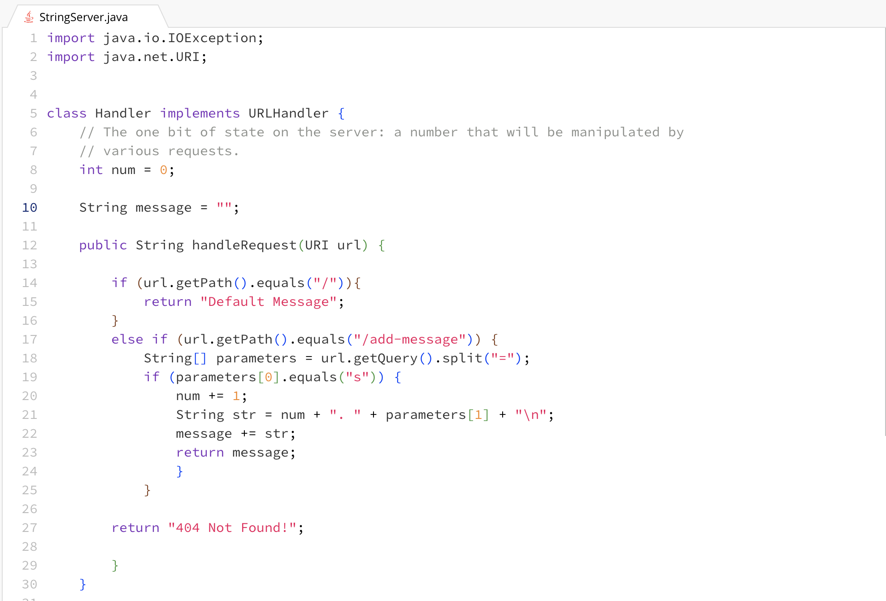
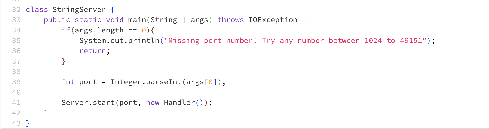

# Servers and SSH Keys

## Part 1

Example 1 of using /add-message: 

- The handleRequest method from the URLHandler interface that
  the Handler class implements gets called. 

- The handleRequest method accepts a URI object as an argument,
  which is the URL that it processes. The fields of the class consist
  of an int variable named num initialized to 0, and a string variable
  named message initialized to an empty string.  

- The int variable num gets incremented whenever a valid string query
  parameter value gets added to the /add-message path at the end of the URL.
  The string variable message starts out as an empty string, then 
  whenever a valid string query parameter value gets added to
  the /add-message path at the end of the URL, that value
  gets added to the message string variable.
  

Example 2 of using /add-message: 

- The handleRequest method from the URLHandler interface that
  the Handler class implements gets called.

- The handleRequest method accepts a URI object as an argument,
  which is the URL that it processes. The fields of the class consist
  of an int variable named num initialized to 0, and a string variable
  named message initialized to an empty string.

- The int variable num gets incremented whenever a valid string query
  parameter value gets added to the /add-message path at the end of the URL.
  The string variable message starts out as an empty string, then 
  whenever a valid string query parameter value gets added to
  the /add-message path at the end of the URL, that value
  gets added to the message string variable.

## Part 2

## Using the *ls* command

Path to my private key for logging onto ieng6: 

Path to my public key for logging onto ieng6:

Logging onto ieng6 without being asked for a password:

## Part 3

In week 2, I learned how to connect to a remote computer or server over the internet
using the *ssh* command. I also learned how to make a simple search engine by 
implementing a web server that tracks a list of strings. 

In week 3, I learned how to securely transfer data over from the local host 
to the remote host by using the *scp* command. 
